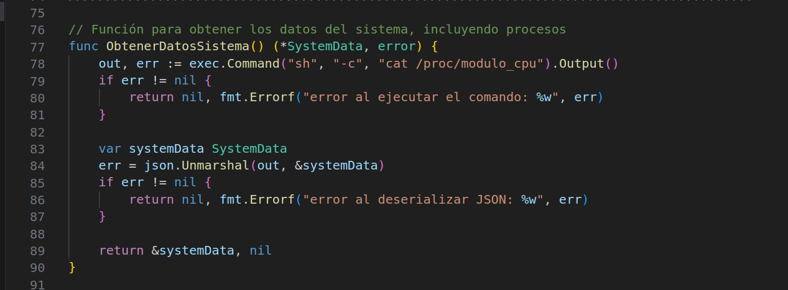

# Manual Técnico 
# Proyecto 1 Sistemas Operativos 1

**Introducción**

El presente documento describe los aspectos técnicos informáticos del sistema de información. El documento introducirá al personal técnico especializado encargado de las actividades de mantenimiento, revisión, solución de problemas, instalación y configuración del sistema.

**Requerimientos**

    Software: 
    -Ubuntu Linux 
    Hardware:
    -PC de 8gb Ram

**Aplicaciones utilizadas**
- Docker 
- Docker Compose
- GCC
- Visual studio code

**Backend**
Se utilizó el lenguaje de progracion Golang.
A continuacion se muestran todos los endpoints utilizados para cada solicitud de información necesaria.

**Funciones implementadas**

- Funcion que se encarga de obtener los datos del sistema por me dio de un cat al archivo modulo_pc

- Funciones StarProcess, Stoprocess, ResumeProcess, Killprocess las cuales fueron implementadas para poder mostar el diagrama y ejecutar los comandos segun el usuario lo desee.

- Funcion que obtien los datos del CPU conecta y envia los datos a la base de datos en Mysql, tambien contiene la respuesta a la solicitud HTTP con los datos en formato Json. 

-  Funcion DataRam se encarga de mostrar el porcentaje de la memoria Ram, se envia el valor a al base de datos y se insertan en la tabla RAM_HISTORIAL, se realiz la conexión a la base de datos por medio de "root:root@tcp(db:3306)/Proyecto1".

**Base de datos**

- Para la base de datos se utilizó MySQL la cual se aloja en un contenedor, usando una imagen de Mysql para poder almacenar los datos de la aplicación.
-  Funcion insertar datos, se encarga de insertar los datos en la tabla RAM_HISTORIAL.
-  Funcion insertar datos2, se encarga de insertar los datos en la tabla CPU_HISTORIAL.
-  Manejo de las solicitudes por medio de DataRamHistorialy DataCpuHistorial.

**Frontend**

Se solicitó el uso de React para el desarrollo del mismo, a travez de una interfaz dinamica utilizando Doker, nodeJs y Nginx para poder tener un servidor en web, por medio del puerto 80 para que pueda ejecutarse el frontend y el backend como servicios dependientes.

**Conexión Nginx**

En esta conexion se especifica que se escuche al puerto 80 para cada ubicacion en especifico, se realiza un proxi pasando la solicitud al servidor llamada Modules escuchando al puerto 8080, se maneja el registro de errores y accesos para las rutas necesarias.

-  location /ram
-  location /cpu 
-  location /kill
-  location /loadCpu
-  location /datacpu
-  location /dataram
-  location /dataramhistorial 
-  location /datacpuhistorial
-  location /dataprocesos 
-  location /startprocess
-  location /resumeprocess
-  location /killprocess

Codigo con la configuración previamete especificada.

- Rutas

**Módulos CPU Y RAM**

- Modulo CPU: Se utilizó el comando insmod sudo insmod cpu_so1_1s2024.ko`para poder obtener el comportamiento de la CPU de eta manera brindando la informacion detallada sobre los procesos en ejecucion tambien los PIDS.

-  Modulo RAM: Se utilizó el comando sudo insmod ram_so1_1s2024.ko, para poder obtener la informacion sobre el porcentaje del uso de la memoria ram en tiempo real.

Codigo implementado en C para obtener los datos.
 